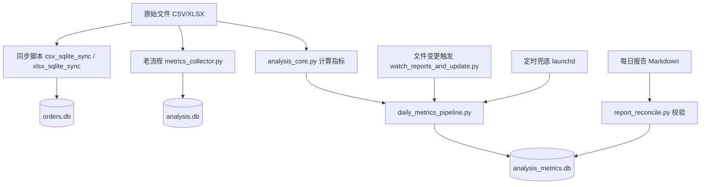

# 数据库更新流程图

```mermaid
flowchart TD
  rawFiles[原始文件 CSV/XLSX] --> syncOrders[同步脚本 csv_sqlite_sync / xlsx_sqlite_sync]
  syncOrders --> ordersDb[(orders.db)]

  rawFiles --> metricsCollector[老流程 metrics_collector.py]
  metricsCollector --> analysisDb[(analysis.db)]

  rawFiles --> analysisCore[analysis_core.py 计算指标]
  analysisCore --> pipeline[daily_metrics_pipeline.py]
  reportMd[每日报告 Markdown] --> reconcile[report_reconcile.py 校验]
  pipeline --> analysisMetricsDb[(analysis_metrics.db)]
  reconcile --> analysisMetricsDb

  watchTrigger[文件变更触发 watch_reports_and_update.py] --> pipeline
  fallbackTrigger[定时兜底 launchd] --> pipeline
```

## 三个库的定位

- `orders.db`：原始订单数据落库（基础层）
- `analysis.db`：老版汇总指标库（`daily_metrics` 等）
- `analysis_metrics.db`：新版分板块分析仓库（看板 + 校验 + 运行日志）

